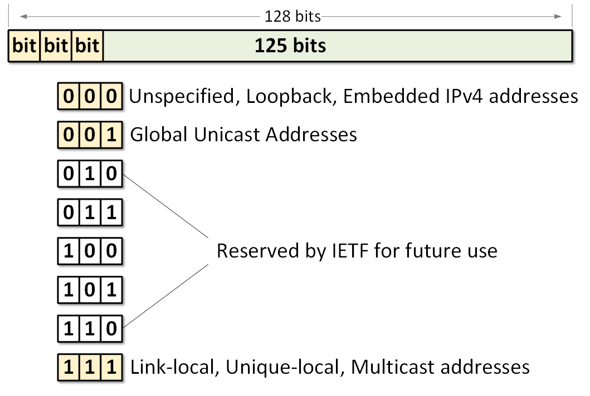
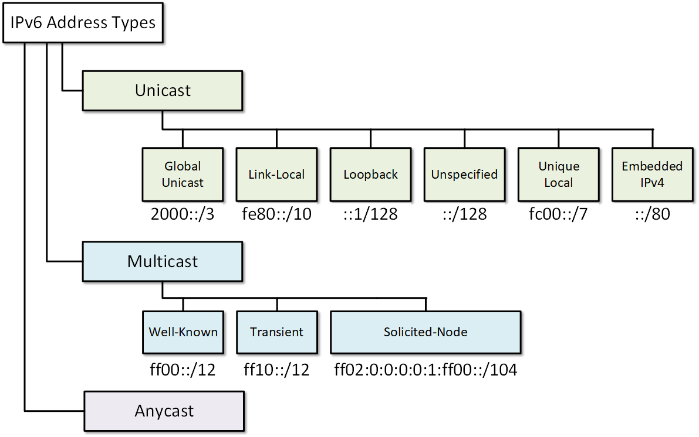
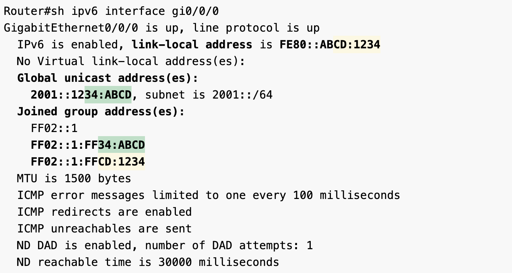
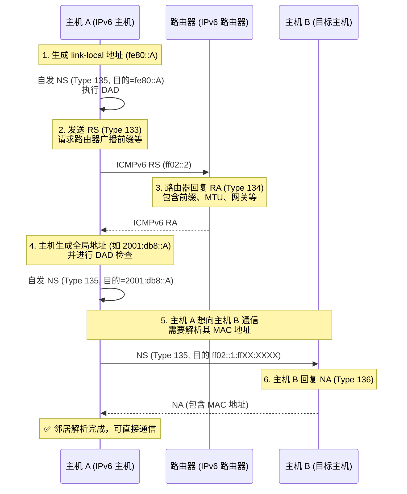
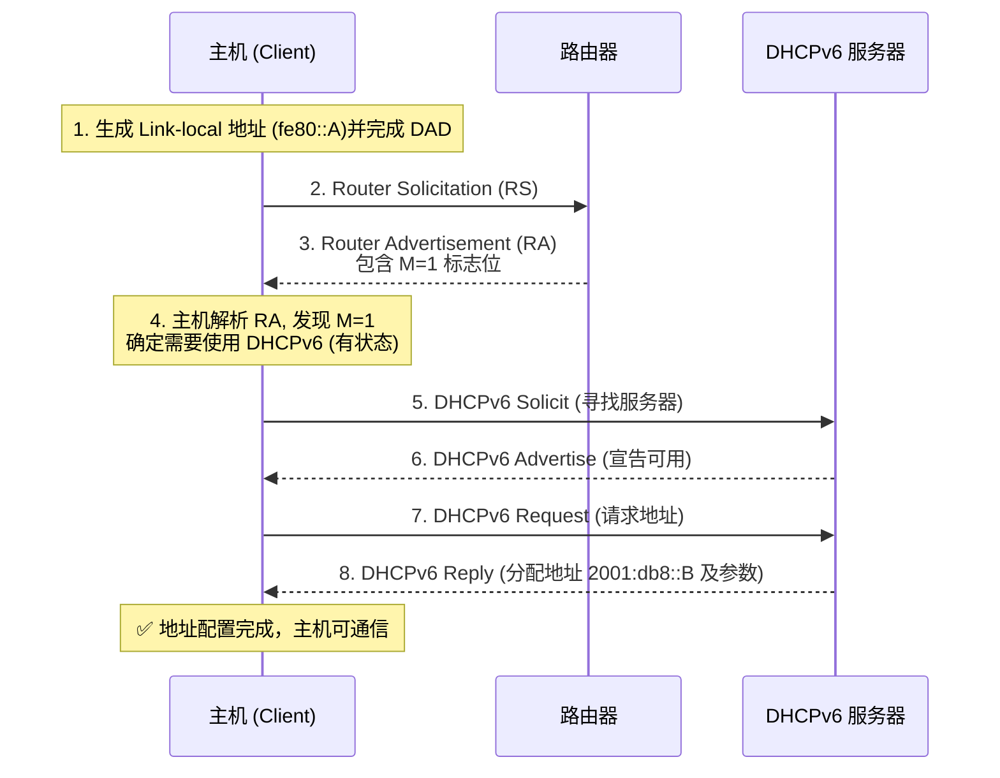

## 地址构成

IPv6地址由 **128位二进制** 组成，通常表示为 **8组16位十六进制数**，每组之间用冒号（:）分隔：

`2001:0db8:0000:0000:0000:ff00:0042:8329`

可进行缩写

`2001:db8::ff00:42:8329`

## 地址种类

### 单播

- Global Unicast Address 全球单播地址
  - 开头通常为 2xxx::/3 例：2001:db8::1
- Link-local Address (LLA) 链路本地地址
  - 只能在本地链路中通信，不可跨路由器。常用于NDP和自动地址配置。
  - fe80::/10
- ULA, Unique Local Address 唯一本地地址
  - 用于本地网络内部通信，类似于IPv4的私有地址（如192.168.0.0/16）
  - fc00::/7

### 多播 Multicast Address

- 开头为 ff00::/8

### 任播 Anycast Addresses

- 和单播形式一样，但是行为不同，只会被最近的一个节点所接受

### ULA vs. **Link-local Address**

| **项目** | **ULA** | **Link-local Address** |
| --- | --- | --- |
| 类似IPv4地址 | 类似私网地址（如 192.168.x.x） | 类似 APIPA（169.254.x.x）地址 |
| 可路由性 | 组织内部可路由 | 只在本地链路有效 |
| 典型用途 | 私有通信、企业内网 | 网络自动配置、路由发现、DHCP替代 |

### Link-local Address 生成的逻辑

`前缀（固定） + 接口标识符（通常基于MAC）`

| **部分** | **长度** | **示例** |
| --- | --- | --- |
| 前缀 | 10位 | fe80::/10（即前两位为1111111010） |
| 填充0（保留） | 54位 | 全部置零 |
| 接口标识符 | 64位 | 通常由 MAC 地址生成 |

完整格式`fe80:0000:0000:0000:XXXX:XXXX:XXXX:XXXX`

接口标识符通常由MAC地址生成（**EUI-64**），但是为了提高隐私，也通常使用随机生成

### Solicited-node multicast address **请求节点多播地址**

是一种特殊的**多播**地址，它是[邻居发现协议（NDP）用来替代 ARP 的核心机制之一](#自动地址配置)

| **部分** | **说明** |
| --- | --- |
| ff02::1:ff00:0/104 | 固定前缀，多播，作用范围为本地链路 |
| ::XX:XXXX | 目标主机地址的**最后 24 位**（即最低 6 个 hex 位） |

### **Multicast Group** 多播组

任何一个主机只要“加入”了这个多播组，就能**自动接收发往这个组地址的包**，无需每次点对点建立连接

对于实现 NDP，只需要将自己的所有 IPv6 地址对应的 Solicited-node multicast address 加入多播组，即可收到来自其他主机的NS请求

多播组的很好避免了IPv4请求中ARP对于0.0.0.0地址的监听，只有目标主机会相应，其他主机无需处理

## ICMPv6

ICMP 是 IPv6 网络的控制协议

位于第三层 —— 网络层

其功能包括：

- 报告错误（如目的不可达）
- 执行诊断（如 ping 和 traceroute）
- 实现 IPv6 的邻居发现协议（**NDP**）
- 支持自动地址配置（SLAAC）

### ICMPv6报文结构

| **字段名** | **长度** | **说明** |
| --- | --- | --- |
| Type | 8 bits | 报文类型，如 128 表示 Echo Request |
| Code | 8 bits | 报文子类型，用于细化 Type 的意义 |
| Checksum | 16 bits | 校验和，校验整个 ICMPv6 报文 |
| Message Body | 变量 | 根据 Type 不同而不同的字段结构 |

IPv6 取消了以下复杂繁琐的 IPv4 机制，全部交由 ICMPv6 完成：

| **IPv4 功能** | **IPv6 替代机制** | **实现协议** |
| --- | --- | --- |
| ARP | 邻居发现（NDP） | ICMPv6 Type 135/136 |
| 广播 | 多播地址配合 ICMPv6 完成 | ICMPv6 + Multicast |
| DHCP 地址配置（可选） | SLAAC + RA | ICMPv6 Type 134 |
| 路由器发现（RIP） | 路由器广告和请求 | ICMPv6 Type 133/134 |

ICMPv6报文分类:

| **类别** | **功能** | **典型报文类型** |
| --- | --- | --- |
| **错误消息** | 报告通信错误 | 目的不可达、分片失败、超时等 |
| **信息消息** | 诊断、请求应答 | Echo Request / Echo Reply |
| **邻居发现（NDP）** | 地址解析、前缀分发、主机自动配置 | Router Solicitation, Advertisement, NS/NA |
| **组播监听（MLD）** | 管理设备加入/退出组播组 | MLD Query, MLD Report |

### **错误消息**

| **类型(Type)** | **名称** | **Code 值含义** |
| --- | --- | --- |
| 1 | Destination Unreachable | 0=无路由；1=管理禁止；3=端口不可达等 |
| 2 | Packet Too Big | 无法转发的最大 MTU |
| 3 | Time Exceeded | TTL 超时或重新组装超时 |
| 4 | Parameter Problem | 报文字段错误（如非法标志位） |

### **信息报文**

| **类型(Type)** | **名称** | **用途** |
| --- | --- | --- |
| 128 | Echo Request | ping 请求 |
| 129 | Echo Reply | ping 应答 |

### Neighbor Discovery Protocol (NDP)

| **类型(Type)** | **名称** | **用途** |
| --- | --- | --- |
| 133 | Router Solicitation (**RS**) | 主机请求路由器广播网络参数 |
| 134 | Router Advertisement (**RA**) | 路由器向主机通告前缀、MTU、默认网关等 |
| 135 | Neighbor Solicitation (**NS**) | 类似 ARP 请求，请求目标 IPv6 地址对应的 MAC 地址 |
| 136 | Neighbor Advertisement (**NA**) | 类似 ARP 响应，返回 MAC 地址 |
| 137 | Redirect | 路由器通知主机使用更优路径 |

#### 地址解析

类似于ARP，当主机要发送数据给同一链路上的其他主机时，需要目标的 MAC 地址

**步骤：**

1. 主机发送 **NS（Type 135）**，目标是 IPv6 多播地址
   - 源地址是自己的 Link-local 地址
   - 目的地址是 ff02::1:ffXX:XXXX（目标地址的后24位）
2. 目标主机收到后，回应 **NA（Type 136）** 报文，告知其 MAC 地址

#### 自动地址配置

主机刚加入网络，需要配置 IPv6 地址

**步骤：**

1. 主机发送 **Router Solicitation（RS，Type 133）**：
   - 请求局域网内的 IPv6 路由器发送网络配置参数
2. 路由器响应 **Router Advertisement（RA，Type 134）**，其中包含：
   - **Prefix Information**：前缀（如 2001:db8:/64），用于地址自动生成
   - **默认网关地址**：即路由器自身的 link-local 地址(必须是 link-local 地址)
   - **Router Lifetime**：如果这个字段大于 0：接收该 RA 的主机会把**发送该 RA 的 IPv6 源地址**作为**默认网关地址**
   - **MTU**：本链路最大传输单元
   - **M/O 标志位**：
     - M（Managed）：是否应使用 DHCPv6 分配地址（有状态）
     - O（Other）：是否应使用 DHCPv6 获取其他参数（如 DNS）
   - **扩展选项** （注意纯RA消息并不包含 DNS/NTP 等参数）

> **RA可以使用 RDNSS（RFC 6106）扩展选项可以使用纯RA报文传递DNS信息**

1. 主机依据 RA 中的配置方式决定地址获取方式：
   - 若 **M=0, O=0**：完全使用 **SLAAC**，主机根据前缀和接口标识符（如 EUI-64）自动生成全球唯一 IPv6 地址
   - 若 **M=0, O=1**：使用 SLAAC 配置地址，**通过 DHCPv6（无状态模式）获取 DNS 等参数**
   - 若 **M=1**（无论 O 位）：
     - 主机启动 **DHCPv6（有状态模式）** 向服务器请求地址、DNS 等参数
2. 地址生成后，主机会通过 **DAD（重复地址检测）** 确保该地址在本链路唯一（使用 NS 报文）

#### DAD 重复地址检测

为了确保新生成的地址在本地唯一

**步骤：**

1. 主机对**自己要使用的地址发送 NS（Type 135）**
   - 目的是对应的多播地址
2. 如果**没人回应**，说明地址可用；若有回应，则表示冲突，需换地址

#### NUD 邻居可达性检测

发送 NS 探测邻居是否在线（类似“ARP Keepalive”）维持邻居缓存表的有效性

#### Redirect 重定向

路由器发送 ICMPv6 Redirect（Type 137）告诉主机一个更近的网关地址

## **IPv6 多播地址到以太网 MAC 地址的映射规则**

在 RS 消息中，我们发送目标地址为 `ff02::2`的数据包，对应需要有一个链路层的MAC多播地址，其中映射规则为：

以太网 MAC 多播地址格式：33:33:XX:XX:XX:XX 其中的 XX:XX:XX:XX 是 IPv6 地址的**最后 32 位（即后 4 字节）**

对应 `ff02::2` 的映射过程：

`ff02::2 = ff02:0000:0000:0000:0000:0000:0000:0002`

**取最后 32 位**得到

`00 00 00 02`

映射为MAC地址

`33:33:00:00:00:02`

以太网链路层发送 RS 或 ICMPv6 消息（如 NS/RA）时，报文结构如下：

| **字段** | **内容** |
| --- | --- |
| 目的 MAC 地址 | 33:33:00:00:00:02 |
| 源 MAC 地址 | 主机网卡的 MAC，例如 ac48:00:11:22 |
| 类型（EtherType） | 0x86DD（表示 IPv6） |
| Payload（负载） | IPv6 报文（包含 ICMPv6 的 RS/RA） |

所有接入该链路的 **IPv6 路由器** 都会监听其网卡上以太网帧目的地址为 33:33:00:00:00:02 的数据，收到后，会从 IPv6 层解析出目标地址 ff02::2，并处理该 RS 请求。

## **对比：不同 IPv6 多播地址的链路层表现**

| **IPv6 多播地址** | **以太网 MAC 地址** | **含义** |
| --- | --- | --- |
| ff02::1 | 33:33:00:00:00:01 | 所有 IPv6 **主机** |
| ff02::2 | 33:33:00:00:00:02 | 所有 IPv6 **路由器** |
| ff02::1:ffxx:xxxx | 33:33:ff:xx:xx:xx | 邻居发现（目标特定主机） |

## IPv6接入通讯的过程

### Steps

Step1: 物理连接

Step2: [生成 Link-local Address](#单播)

Step3: Router Advertisement 发现路由器

使用 [NDP(Neighbor Discovery Protocol)](#neighbor-discovery-protocol-ndp) ，类似于IPv4中的ARP和DHCP

1. 发送 **RS** 消息，目标地址为 `ff02::2`（所有路由器多播地址）
2. 收到路由器的 **RS** 回复 **RA**, 包括
   1. 网络前缀
   2. 默认网关
   3. 有效期
   4. M/O 标志位
   5. MTU
   6. RA 扩展

Step4: 利用 **SLAAC** 生成全球单播地址 或 利用 DHCPv6 获取 地址和其他信息

## NATv6

由于IPv6没有地址耗尽的问题，所以IPv6一般不使用NAT(**Network Address Translation**)

## DHCPv6

DHCPv6 (Dynamic Host Configuration Protocol for IPv6) 是 IPv6 的动态主机配置协议版本。虽然 SLAAC 提供了基本的自动配置，但 DHCPv6 提供了对地址分配和网络参数分发的更集中和详细的控制。它可以在两种主要模式下运行：**有状态**和**无状态**，这由路由器 RA 消息中的 **M** 和 **O** 标志决定。

DHCPv6 (Dynamic Host Configuration Protocol for IPv6) is the version of the Dynamic Host Configuration Protocol for IPv6. While SLAAC provides basic auto-configuration, DHCPv6 offers more centralized and detailed control over address assignment and network parameter distribution. It can operate in two primary modes: **stateful** and **stateless**, determined by the **M** and **O** flags in the router's RA messages.

### 主要功能 (Main Functions)

- **地址分配 (Address Assignment)**: Assigns global unicast IPv6 addresses and manages leases.
- **参数分发 (Parameter Distribution)**: Provides other essential configuration information, such as **DNS server addresses**, NTP server addresses, and domain names.
- **集中化管理 (Centralized Management)**: Allows network administrators to manage and track IPv6 address assignments from a central server.

### 工作模式 (Operating Modes)

DHCPv6's behavior is typically dictated by the M (Managed) and O (Other) flags in the ICMPv6 RA message(RA，Type 134).

| **模式** | **RA 标志位** | **描述** | **主机行为** |
| :--- | :--- | :--- | :--- |
| **有状态 (Stateful)** | M=1 | The DHCPv6 server directly assigns an IPv6 address to the host and keeps a record ("state") of the lease. | Host contacts a DHCPv6 server to request a specific IPv6 address and any other available parameters (like DNS). |
| **无状态 (Stateless)** | M=0, O=1 | The host generates its own IPv6 address using SLAAC. The DHCPv6 server does **not** assign an address but provides other configuration parameters (e.g., DNS). The server does not maintain lease records for addresses. | Host uses SLAAC for its address and contacts a DHCPv6 server **only** to request additional information like DNS server addresses. |

### 工作流程 (Workflow)

DHCPv6 uses a four-step message exchange process between the client and server to assign an address. This is different from the DORA (Discover, Offer, Request, Acknowledge) process in IPv4.

1. **Solicit (请求)**:
    - A client sends a **Solicit** message to the "All\_DHCP\_Relay\_Agents\_and\_Servers" multicast address (`ff02::1:2`) to locate DHCPv6 servers.
2. **Advertise (通告)**:
    - Servers that can provide service respond to the client with an **Advertise** message, announcing their availability.
3. **Request (请求)**:
    - The client chooses one of the servers and sends a **Request** message to that server, asking for an address and other configuration data.
4. **Reply (回复)**:
    - The chosen server responds with a **Reply** message containing the assigned IPv6 address lease and any other requested parameters (like DNS servers).

### DHCPv6 报文和端口 (Messages and Ports)

DHCPv6 communication relies on specific **UDP ports** and message types.

> ICMPv6, like RA RA DAD, doesn't use ports, because it operates at the Network Layer (Layer 3), not Transport Layer (Layer 4).

| **项目** | **说明** |
| :--- | :--- |
| **客户端端口 (Client Port)** | UDP Port **546** |
| **服务器端口 (Server Port)** | UDP Port **547** |
| **客户端标识 (Client Identifier)** | **DUID** (DHCP Unique Identifier), which is unique across all clients. |
| **主要报文 (Key Messages)** | Solicit, Advertise, Request, Reply |
