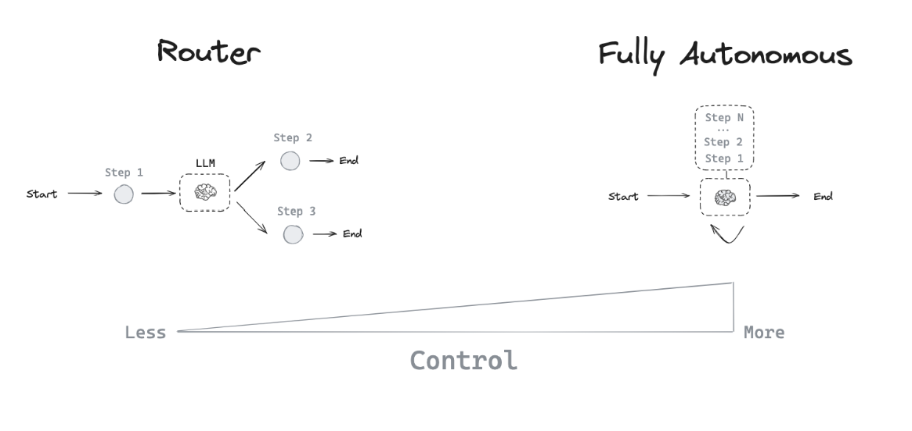

* LangGraph 是一个构建 Workflows  & agents 的框架

Workflows 和 Agent 的区别？

* Workflows 是一系列有序的任务，通常是线性的，强调任务之间的依赖关系。类似于DAG有向无环图
* Agent 是一个自主的实体，能够根据环境和输入做出决策，通常是非线性的（存在循环），强调自主性和智能。

Agent的架构

* LLM 可以在两个潜在路径之间选择路由！
* LLM 可以决定调用许多工具中的哪一个？
* LLM 可以决定生成的答案是否足够，还是需要做更多工作？



对于一个ReAct Agent, 有三个核心的概念

* Tool calling: 允许LLM调用外部工具或API来获取信息或执行操作，依赖于大型语言模型（LLM）的工具调用能力，并基于消息列表进行操作。
* Memory: 允许LLM存储和检索信息，以便在后续的交互中使用。
* Reasoning: 允许LLM进行推理和决策，以便在复杂的任务中做出更好的选择。

### Example

```python
from typing import TypedDict, Dict
from pydantic import BaseModel, Field
from typing_extensions import Literal
from langgraph.graph import StateGraph, START, END
from langchain_ollama import OllamaLLM
from json_parser import parse_and_validate

# 使用本地Ollama模型
llm = OllamaLLM(model="mistral-nemo:latest")  # 你可以根据需要更换模型名称

# 定义Pydantic模型用于验证
class JokeEvaluation(BaseModel):
    grade: Literal["funny", "not funny"] = Field(description="笑话是否有趣")
    feedback: str = Field(description="改进建议")

# Graph state
class State(TypedDict):
    joke: str
    topic: str
    feedback: str
    funny_or_not: str

# Nodes
def llm_call_generator(state: State) -> Dict[str, str]:
    """LLM generates a joke"""
    print(f"llm_call_generator: {state}")
    
    if state.get("feedback"):
        prompt = f"Write a joke about {state['topic']} but take into account the feedback: {state['feedback']}"
    else:
        prompt = f"Write a joke about {state['topic']}"
    
    result = llm.invoke(prompt)
    return {"joke": result}

def llm_call_evaluator(state: State) -> Dict[str, str]:
    """LLM evaluates the joke"""
    print(f"llm_call_evaluator: {state}")
    
    # 生成JSON模板
    template = JokeEvaluation.model_json_schema()
    
    prompt = f"""
    请评估以下笑话，并返回JSON格式的响应：
    
    笑话: {state['joke']}
    
    请分析这个笑话是否有趣，并严格按照以下JSON SCHEMA格式返回：
    {template}
    
    只返回JSON格式，不要其他内容。
    """
    
    result = llm.invoke(prompt)
    
    # 定义默认值
    fallback_values = {
        "grade": "not funny",
        "feedback": "评估过程出错，请重新生成笑话"
    }
    

    # 解析和验证JSON
    evaluation = parse_and_validate(result, JokeEvaluation, fallback_values)
    
    return {
        "funny_or_not": evaluation.grade,
        "feedback": evaluation.feedback
    }


# Conditional edge function to route back to joke generator or end based upon feedback from the evaluator
def route_joke(state: State) -> str:
    """Route back to joke generator or end based upon feedback from the evaluator"""
    print(f"route_joke: {state}")
    
    if state["funny_or_not"] == "funny":
        return "Accepted"
    elif state["funny_or_not"] == "not funny":
        return "Rejected + Feedback"
    else:
        return "Rejected + Feedback"  # 默认情况

# Build workflow
optimizer_builder = StateGraph(State)

# Add the nodes
optimizer_builder.add_node("llm_call_generator", llm_call_generator)
optimizer_builder.add_node("llm_call_evaluator", llm_call_evaluator)

# Add edges to connect nodes
optimizer_builder.add_edge(START, "llm_call_generator")
optimizer_builder.add_edge("llm_call_generator", "llm_call_evaluator")
optimizer_builder.add_conditional_edges(
    "llm_call_evaluator",
    route_joke,
    {  # Name returned by route_joke : Name of next node to visit
        "Accepted": END,
        "Rejected + Feedback": "llm_call_generator",
    },
)

# Compile the workflow
optimizer_workflow = optimizer_builder.compile()

# Invoke
initial_state: State = {
    "topic": "Dogs", 
    "joke": "", 
    "feedback": "", 
    "funny_or_not": ""
}
state = optimizer_workflow.invoke(initial_state)
print("最终笑话:")
print(state["joke"])
print(f"\n评估结果: {state['funny_or_not']}")
if state.get("feedback"):
    print(f"反馈: {state['feedback']}")
```