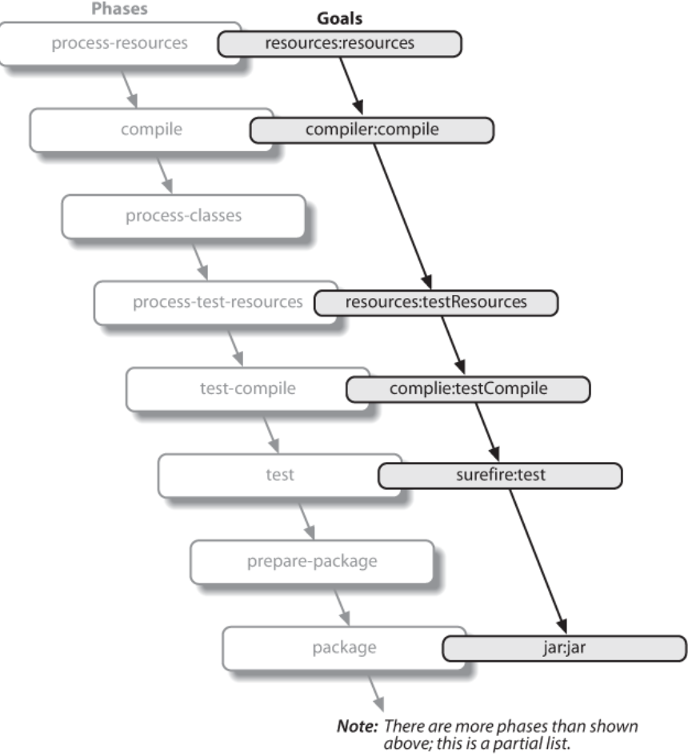
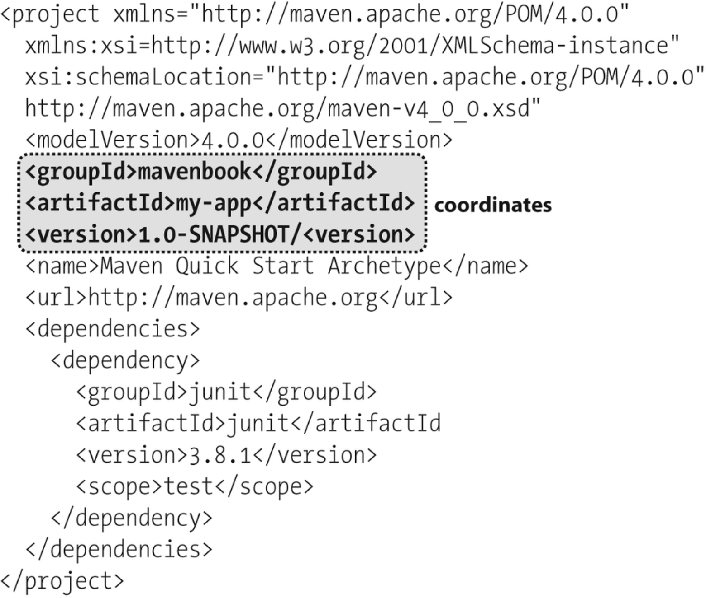

## Maven By Example

### archetype:generate

```sh
mvn archetype:generate \
    -DgroupId=org.sonatype.mavenbook.ch03 \
    -DartifactId=simple \
    -DarchetypeGroupId=org.apache.maven.archetypes \
    -DarchetypeArtifactId=maven-archetype-quickstart \
    -DinteractiveMode=false
```

这个命令是 `maven-archetype-plugin` 插件的 `generate` 目标。它的核心功能是：根据一个原型（Archetype）来生成一个新项目的骨架

{}

为什么 `maven-archetype-plugin` 可以直接简写为 `archetype` 使用？

这个规则是 Maven 内部机制和插件命名规范共同作用的结果，具体规定在以下两个地方：

* Maven 的核心内置配置 (Built-in Configuration)：规定了“去哪里找”
* 插件本身的元数据 (Plugin Metadata)：规定了“我叫什么”

当你执行一个命令，比如 `mvn archetype:generate` 时，Maven 并不知道 `archetype` 是什么。它会执行一个叫做“前缀解析”的查找过程，来把这个简短的前缀（prefix）映射到一个完整的插件坐标`org.apache.maven.plugins:maven-archetype-plugin` (groupId:artifactId)。

**遵循以下规则：**

* 查找默认的插件组 (Default Plugin Groups)  
    Maven 的核心配置中，预先定义了一个默认的插件组列表 (pluginGroups)。其中最重要的、硬编码在程序里的就是：`org.apache.maven.plugins`
* 若插件元数据文件定义了`<goalPrefix>`
    如果插件的元数据文件（通常是 `META-INF/maven/plugin.xml`）中定义了 `<goalPrefix>`，Maven 会直接使用这个前缀来匹配插件。例如：

```xml
<project>
  ...
  <build>
    ...
    <plugins>
      ...
      <plugin>
        <artifactId>maven-plugin-plugin</artifactId>
        <version>3.15.1</version>
        <configuration>
          ...
          <goalPrefix>somePrefix</goalPrefix>
        </configuration>
      </plugin>
    </plugins>
  </build>
</project>
```

上述配置将允许用户通过前缀 somePrefix 来引用你的插件，如下例所示：

```sh
mvn somePrefix:goal
```

* 根据命名规范进行匹配
    当 Maven 拿到一个前缀（比如 archetype）时，它会尝试在这个默认的插件组 (`org.apache.maven.plugins`) 中寻找一个符合命名规范的 artifactId。匹配的模式主要有两种：
  * `maven-${prefix}-plugin` (官方插件最常用的模式)
  * `${prefix}-maven-plugin`
    同样的道理也适用于其他官方插件：
  * `mvn compiler:compile -> compiler` 被解析为 `maven-compiler-plugin`
  * `mvn surefire:test -> surefire` 被解析为 `maven-surefire-plugin`

**在哪里可以自定义插件组(Plugin Groups)？**

可以在 `settings.xml` 文件中扩展插件组列表 (pluginGroups)，添加 `<pluginGroups>` 标签，把常用的第三方插件的 groupId 加进去。

例如：
如果你经常使用 Spring Boot 的插件，它的 groupId 是 org.springframework.boot。你可以这样配置：

```xml
<settings>
  ...
  <pluginGroups>
    <pluginGroup>org.springframework.boot</pluginGroup>
  </pluginGroups>
  ...
</settings>
```

配置好之后，原本需要输入完整命令：

```sh
mvn org.springframework.boot:spring-boot-maven-plugin:run
```

现在就可以简写为：

```sh
mvn spring-boot:run
```

Maven 会在默认的 `org.apache.maven.plugins` 中查找失败后，继续在你配置的 `org.springframework.boot` 组中查找，并成功匹配到 `spring-boot-maven-plugin`

{}

我们来解析一下这些 -D 参数：

* -DgroupId, -DartifactId, -Dversion: 这三个定义了你的新项目的坐标。
* -DarchetypeGroupId, -DarchetypeArtifactId, -DarchetypeVersion: 这三个定义了你使用的原型的坐标。generate 命令需要明确知道你想用哪个模板来创建项目。
* -DinteractiveMode=false: 这个参数告诉 Maven 关闭交互模式，直接使用命令行提供的参数创建项目

事实上这里体现了**约定优于配置(Convention over Configuration)原则**。我们只是传入了 groupId 和 artifactId 这两个项目信息，Maven 就能根据这些信息和预定义的原型模板来生成一个完整的项目结构。

### Maven 插件架构

Maven 核心本身非常小，它只包含了解析命令、管理 pom.xml 和下载插件等最基础的功能。所有具体的工作（如编译、打包）都委托给插件完成，并且这些插件只在需要时才会被下载。这种插件化架构将“做什么”（Maven 核心的生命周期）和“怎么做”（插件的具体实现）彻底解耦，带来了轻量、标准、灵活、可重用和易于维护的巨大优势。

一个Maven插件(Maven plugin)是一组或多个目标(goals)的集合。目标(goals)是一个具体任务，可以作为独立目标执行，也可以与其他目标一起作为更大构建的一部分执行。目标(goals)通过配置属性配置，这些属性可用于定制行为。例如，Compiler 插件的编译目标定义了一组配置参数，这些参数允许您指定目标 JDK 版本或是否使用编译器优化。

### Maven 生命周期

Maven 的 构建生命周期 (Build Lifecycle) 是一个项目构建过程的有序步骤序列。  
这个序列中的每一步都称为一个阶段 (Phase)。最常用的生命周期是默认生命周期 (Default Lifecycle)，它从验证项目开始，到部署项目结束。

阶段本身只是一个“标记”，它本身不做任何事。真正的工作是由绑定（或附加）到这些阶段上的插件目标 (Plugin Goals) 完成的。  
当 Maven 按顺序执行生命周期时，它会触发每个阶段上绑定的所有插件目标。从生命周期的起点开始，按顺序执行直到你指定的阶段为止。一个阶段可以绑定零个或多个目标。



生命周期阶段的定义是故意设计得比较模糊的，其具体含义取决于项目的类型。  
例子：package 阶段对于一个普通 Java 项目（打包方式为 jar），意味着“创建一个 JAR 文件”，因此会绑定 jar:jar 这个目标。但对于一个 Web 项目（打包方式为 war），同一个 package 階段则可能意味着“创建一个 WAR 文件”。

{}

是的，绝对是。

Maven 的生命周期（Lifecycle）及其包含的阶段（Phase）的定义、顺序和骨架，是 Maven 框架最核心、最基础的组成部分。可以这样理解：

生命周期和阶段 (Lifecycle & Phase)：是 Maven 定义的一套标准化的流程和步骤（比如先编译、再测试、后打包）。这个“流程图”是内置在 Maven 核心中的，它规定了“做什么”以及“按什么顺序做”。
插件 (Plugin)：是具体“干活的人”。它们负责执行每个步骤的实际工作。
所以，Maven 核心提供了不变的、标准化的构建流程框架，而插件则提供了可变的、可配置的具体实现。这种分离正是 Maven 强大和灵活的关键。

{}

{}

参考：[Lifecycle Reference](https://maven.apache.org/guides/introduction/introduction-to-the-lifecycle.html)

#### A. `default` 生命周期（最重要的构建生命周期）

1. `validate`: 验证项目是否正确以及所有必需的信息是否可用。
2. `initialize`: 初始化构建状态，例如设置属性。
3. `generate-sources`: 生成任何需要包含在编译过程中的源代码。
4. `process-sources`: 处理源代码，例如过滤值。
5. `generate-resources`: 生成需要打包到项目中的资源文件。
6. `process-resources`: 将资源文件复制并处理到目标目录，准备打包。
7. `compile`: **编译项目的源代码。**
8. `process-classes`: 对编译生成的文件进行后处理，例如字节码增强。
9. `generate-test-sources`: 生成测试用的源代码。
10. `process-test-sources`: 处理测试源代码。
11. `generate-test-resources`: 生成测试用的资源文件。
12. `process-test-resources`: 将测试资源文件复制并处理到测试目标目录。
13. `test-compile`: 编译测试源代码。
14. `process-test-classes`: 对测试编译生成的文件进行后处理。
15. `test`: **使用合适的单元测试框架（如 JUnit）运行测试。**
16. `prepare-package`: 在打包前进行准备工作。
17. `package`: **将编译后的代码打包成可分发的格式，如 JAR、WAR 等。**
18. `pre-integration-test`: 在集成测试前进行准备。
19. `integration-test`: 运行集成测试。
20. `post-integration-test`: 在集成测试后进行清理。
21. `verify`: **运行检查以验证包是否有效并符合质量标准。**
22. `install`: **将包安装到本地仓库，供本地其他项目依赖。**
23. `deploy`: **将最终的包复制到远程仓库，与其他开发者或项目共享。**

#### B. `clean` 生命周期

用于清理上一次构建生成的文件。

**主要阶段：**

1. `pre-clean`: 在实际清理前执行一些操作。
2. `clean`: **移除上一次构建生成的所有文件（通常是 `target` 目录）。**
3. `post-clean`: 在实际清理后执行一些操作。

#### C. `site` 生命周期

用于生成和部署项目站点（项目文档、报告等）。

**主要阶段：**

1. `pre-site`: 在生成站点文档前执行一些操作。
2. `site`: **生成项目的站点文档。**
3. `post-site`: 在生成站点文档后执行一些操作，例如进行打包。
4. `site-deploy`: 将生成的站点文档部署到指定的服务器。


用连字符命名的阶段（pre-*、post-* 或 process-*）通常不直接从命令行调用。这些阶段对构建进行排序，产生构建外部无用的中间结果。在调用 integration-test 的情况下，环境可能会处于挂起状态。


{}

{}

#### 方式一：默认绑定 (由打包方式 `<packaging>` 决定)

这是 Maven “约定大于配置”理念的体现。Maven 会根据你在 `pom.xml` 中设置的打包方式（`<packaging>`，如 `jar`, `war`, `pom`），为核心的生命周期阶段绑定一套默认的插件目标。

* 如果你的 `pom.xml` 中有 `<packaging>jar</packaging>` (或者不写，因为 `jar` 是默认值)。
* Maven 会自动将 `maven-compiler-plugin` 的 `compile` 目标绑定到 `compile` 阶段，将 `maven-surefire-plugin` 的 `test` 目标绑定到 `test` 阶段，将 `maven-jar-plugin` 的 `jar` 目标绑定到 `package` 阶段。
* 你完全**不需要任何配置**，执行 `mvn package` 时，编译、测试、打包工作就会自动进行。

参考：[Built-in Lifecycle Bindings](https://maven.apache.org/guides/introduction/introduction-to-the-lifecycle.html)

#### 方式二：插件的“默认阶段绑定” (Default Phase Binding)

有些为特定目的而设计的插件（比如代码生成、资源处理），其作者已经预见到了它最常见的用例。因此，在插件本身的元数据中，开发者已经定义了它的默认绑定阶段。

例如，Modello 插件默认将其目标 `modello:java` 绑定到 `generate-sources` 阶段，我们只需要在 `pom.xml` 中添加如下配置：

```xml { hl_lines=["5-16"] }
 <plugin>
   <groupId>org.codehaus.modello</groupId>
   <artifactId>modello-maven-plugin</artifactId>
   <version>1.8.1</version>
   <executions>
     <execution>
       <configuration>
         <models>
           <model>src/main/mdo/maven.mdo</model>
         </models>
         <version>4.0.0</version>
       </configuration>
       <goals>
         <goal>java</goal>
       </goals>
     </execution>
   </executions>
 </plugin>
```

您可能想知道为什么要使用 `<executions>` 元素。这样您就可以在需要时使用不同的配置多次运行同一个目标。还可以给单独的执行赋予一个 ID，这样在继承或应用配置文件时，就可以控制目标配置是被合并还是被转化为额外的执行。

#### 方式三：手动绑定 (Manual Binding)

如果你需要更细粒度的控制，或者想要在特定阶段执行某个插件的目标，你可以手动绑定插件目标到生命周期阶段。  
例如，假设有一个目标 display:time，它能在命令行中回声显示当前时间，你希望它在 process-test-resources 阶段运行，以显示测试何时开始。可以这样配置

```xml {hl_lines=[7] }
 <plugin>
   <groupId>com.mycompany.example</groupId>
   <artifactId>display-maven-plugin</artifactId>
   <version>1.0</version>
   <executions>
     <execution>
       <phase>process-test-resources</phase>
       <goals>
         <goal>time</goal>
       </goals>
     </execution>
   </executions>
 </plugin>
 ```

{}

### Maven 命令格式

Maven 的命令格式通常是 `mvn [phase] [plugin-prefix:goal]` ，主要分为两大类：

1. 执行生命周期阶段 (Lifecycle Phase)

   * **命令格式**: `mvn [phase]`
   * **例子**: `mvn compile`, `mvn package`, `mvn install`
   * **目的**: 对一个**已经存在**的项目，按照预定义的标准流程进行构建、测试、打包和安装。
   * **工作方式**: 当你执行一个 `phase` 时，Maven 会按顺序执行该生命周期中从开始到指定阶段的所有步骤。例如，`mvn install` 会依次执行 `validate`, `compile`, `test`, `package`, `install` 等一系列阶段。这些阶段的核心是处理你项目的源代码和资源。
  
2. 直接执行插件目标 (Direct Plugin Goal)
   * **命令格式**: `mvn [plugin-prefix]:[goal]`
   * **例子**: `mvn archetype:generate`, `mvn clean:clean`, `mvn dependency:tree`
   * **目的**: 执行一个**独立的、特定的任务**，这个任务通常不属于标准的项目构建流程，或者是构建流程中的某个具体步骤的独立调用。
   * **工作方式**: 此命令会绕过生命周期，直接找到指定的插件并执行其提供的特定功能（`goal`）。

### Maven Cordinates



Maven 坐标（Coordinates）是 Maven 用来**唯一标识一个项目或依赖**的方式。它由以下四个部分组成：

* **groupId**: 组织或公司标识符，通常是反向域名格式（如 `org.apache.maven.plugins`）
* **artifactId**: 项目的唯一标识符，通常是项目的名称（如 `maven-archetype-plugin`）
* **packaging**: 项目的打包方式；通常是 `jar`、`war`、`pom` 等
* **version**: 项目的版本号（如 `3.2.0`）；处于积极开发中的项目可以使用一个特殊的标识符，将版本标记为 SNAPSHOT。

其排列的方式为 `groupId:artifactId[:packaging[:version]]`  

例如 `JUnit:junit:jar:4.13.2` 代表了 JUnit 4.13.2 版本的 JAR 包。

### Maven Repositories

Maven 仓库是用来存储所有项目构件（Artifacts，如 JAR 文件）和插件（Plugins）的地方。Maven 本身安装包之所以很小（约 1.5MB），就是因为它只包含最核心的功能。所有具体的工作（如编译、打包）都由插件完成，而这些插件都是在需要时才从远程仓库下载的。

#### Maven 仓库的种类

1. 远程仓库 (Remote Repository)
   * 中央仓库 (Central Repository)：Maven 自带一个默认的远程仓库地址 (`https://repo1.maven.org/maven2/`)，绝大多数开源的库都可以从这里下载。
   * 私有/自定义仓库 (Custom Repository)：公司或组织可以架设自己的私有仓库，用于存放内部项目或无法公开的商业库。这些私有仓库可以作为中央仓库的补充或镜像。
2. 本地仓库 (Local Repository)
   * 这是一个位于你自己的电脑上的文件夹（通常在 ~/.m2/repository）
   * 作为本地项目间的共享机制和缓存机制

#### Maven 仓库的目录结构

Maven 仓库不是一个随意的文件夹，它有着非常严格的、标准化的目录结构

按照 `/<groupId 的路径>/<artifactId>/<version>/<artifactId>-<version>.<packaging>` 的格式来组织文件。  

例子：坐标为 `org.apache.commons:commons-email:1.1` 的 JAR 文件，其存储路径就是 `/org/apache/commons/commons-email/1.1/commons-email-1.1.jar`，结合中央仓库地址得到:

``` {}
https://repo1.maven.org/maven2/org/apache/commons/commons-email/1.1/commons-email-1.1.jar
```
