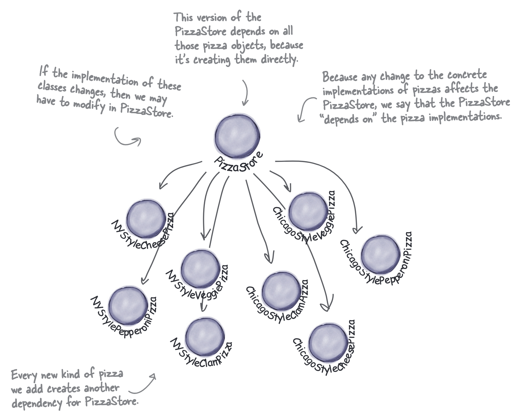
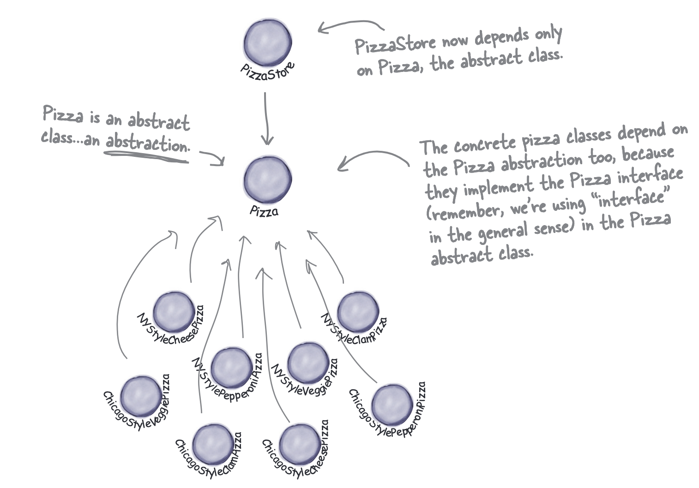
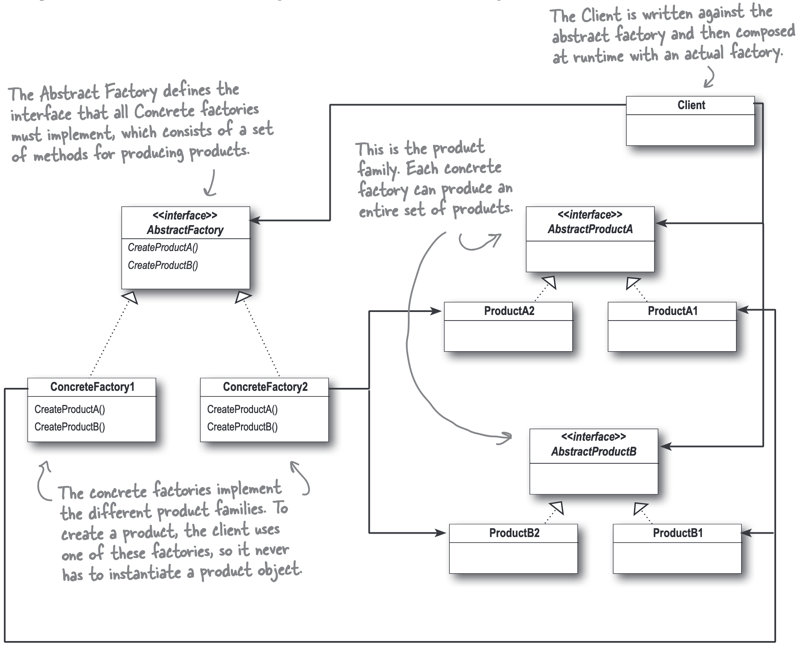

## The Simple Factory

### Example1

When we meet code like this: We’ve got several concrete classes being instantiated, and the decision of which to instantiate is made **at runtime** depending on some set of conditions.  
当我们遇到像这样的代码：我们有几个具体的类被实例化，而实例化哪个类是在**运行时**根据一些条件做出的。

```java
Pizza orderPizza(String type) {
  Pizza pizza;
  if (type.equals("cheese")) {
    pizza = new CheesePizza();
  } else if (type.equals("greek")) {
    pizza = new GreekPizza();
  } else if (type.equals("pepperoni")) {
    pizza = new PepperoniPizza();
  } else {
    pizza = null; // or handle unknown type
  }
  if (pizza != null) {
    ...
  }
  return pizza;
}
```

{}
问题不在于 new 操作符本身，而在于它会将代码与“具体”的类实现紧密地耦合在一起。

1. 真正的罪魁祸首是“变化” (CHANGE)：当你在代码中直接使用 new 来创建一个具体类的实例时（例如 new Dog()），你的代码就焊死在了 Dog 这个具体的实现上。
2. 违反“开闭原则”：理想的设计应该是“对扩展开放，对修改关闭”。但如果将来系统需要变化，比如要换成使用 Cat 类，你就必须找到所有 new Dog() 的地方，然后修改代码。这就意味着你的代码对于“修改”并不是关闭的。为了扩展功能（增加一个新的类），你被迫要修改旧有的代码。
3. 缺乏灵活性：这种硬编码（hard-coding）的方式使得系统难以适应变化。而文中的解决方案是提倡“面向接口编程”，通过多态来隔离变化，从而让系统在不修改现有代码的情况下，就能适应新的具体类。
{}

We can use the **Simple Factory Pattern** to encapsulate the instantiation logic in a separate class.  
我们可以使用**简单工厂模式**将实例化逻辑封装在一个单独的类中。

```java
public class SimplePizzaFactory {
  public Pizza createPizza(String type) {
    Pizza pizza = null;

    if (type.equals("cheese")) {
      pizza = new CheesePizza();
    } else if (type.equals("pepperoni")) {
      pizza = new PepperoniPizza();
    } else if (type.equals("clam")) {
      pizza = new ClamPizza();
    } else if (type.equals("veggie")) {
      pizza = new VeggiePizza();
    }

    return pizza;
  }
}
```

{}
SimplePizzaFactory may have many clients. All of them can use the same factory to create pizzas, and they don’t need to know about the concrete classes. If we want to add a new type of pizza, we just need to modify the factory class without changing the client code.
{}

{}
Depends on the context.

If the factory is a utility class that provides a simple way to create objects without maintaining any state, then a static method is appropriate.
However, it can’t be subclassed or have the behavior of the `create(...)` method changed through inheritance.

If the factory needs to maintain state or configuration, then it should be an instance method.
{}

Using the Simple factory in a pizza store:

```java { hl_lines="2 4-6 10" }
public class PizzaStore {
  SimplePizzaFactory factory;

  public PizzaStore(SimplePizzaFactory factory) {
    this.factory = factory;
  }

  public Pizza orderPizza(String type) {
    Pizza pizza;
    pizza = factory.createPizza(type);

    pizza.prepare();
    pizza.bake();
    pizza.cut();
    pizza.box();

    return pizza;
  }
}
```

### The Simple Factory Defined


* `PizzaStore` 持有 `SimplePizzaFactory` 的引用
* `SimplePizzaFactory` 负责创建 `Pizza` 对象
* `Pizza`是一个抽象类或接口或是一个类（我们说“implement an interface”并不是说一定要定义一个抽象的类或是一个Interface，一个具体的类作为具体的类的父类也是OK的），`CheesePizza`、`PepperoniPizza`、`ClamPizza` 和 `VeggiePizza` 都是 `Pizza` 的子类，是具体的实现类
* `PizzaStore` 通过 `SimplePizzaFactory` 的 `createPizza` 方法来创建具体的 `Pizza` 对象

## Factory Method Pattern

### Example2

当我们需要有不同种类的`PizzaStore`时，我们可以对 [Example1](#example1) 做一些更改：把 `SimplePizzaFactory` 中的`createPizza` 方法放进 `PizzaStore` 中，并且把`PizzaStore`设置为抽象类，`createPizza`方法变成抽象方法。

```java {hl_lines="14"}
public abstract class PizzaStore {
  public Pizza orderPizza(String type) {
    Pizza pizza;
    pizza = createPizza(type);

    pizza.prepare();
    pizza.bake();
    pizza.cut();
    pizza.box();

    return pizza;
  }

  protected abstract Pizza createPizza(String type);
}
```

PizzaStore 是一个抽象类，它定义了一个抽象的 createPizza 方法。披萨的创建逻辑被延迟到 PizzaStore 的具体子类中去实现

这样，我们就可以创建不同的 `PizzaStore` 子类来实现不同的 `createPizza` 方法，例如：

```java
public class NYPizzaStore extends PizzaStore {
  @Override
  protected Pizza createPizza(String type) {
    if (type.equals("cheese")) {
      return new NYStyleCheesePizza();
    } else if (type.equals("pepperoni")) {
      return new NYStylePepperoniPizza();
    } else if (type.equals("clam")) {
      return new NYStyleClamPizza();
    } else if (type.equals("veggie")) {
      return new NYStyleVeggiePizza();
    } else {
      return null; // or handle unknown type
    }
  }
}

public class ChicagoPizzaStore extends PizzaStore {
  @Override
  protected Pizza createPizza(String type) {
    if (type.equals("cheese")) {
      return new ChicagoStyleCheesePizza();
    } else if (type.equals("pepperoni")) {
      return new ChicagoStylePepperoniPizza();
    } else if (type.equals("clam")) {
      return new ChicagoStyleClamPizza();
    } else if (type.equals("veggie")) {
      return new ChicagoStyleVeggiePizza();
    } else {
      return null; // or handle unknown type
    }
  }
}
```


Factory Method Pattern 的好处是：
实现了**产品的实现和使用**的解耦：`PizzaStore` 不需要知道具体的 `Pizza` 实现类，只需要知道如何使用 `createPizza` 方法来创建 `Pizza` 对象。

### Factory Method Pattern defined


The Factory Method Pattern defines an interface for creating an object, but lets subclasses decide which class to instantiate. Factory Method lets a class defer instantiation to subclasses.
工厂方法模式定义了一个用于创建对象的接口，但允许子类决定实例化哪一个类。工厂方法使一个类将实例化推迟到子类。

* Creator 和 Product 都是抽象层
* 创建 具体对象实例(ConcreteProduct) 的定义位于 Creator 的子类实现中，创建的都必须满足 Product 的抽象接口

## The Simple Factory vs. Factory Method

对于 The Simple Factory 的主要目的是避免 `if-else` 模块反复在代码中出现，将构造的代码提出到一个单独的类中；而 Factory Method 的主要目的是主抽象类不实现具体的创建逻辑，而是将创建逻辑交给子类去实现。

{}

```java
// 主要目的是避免反复在代码中出现 if-else 判断模块
// SimplePaymentFactory：这是简单工厂模式的核心，负责所有 Payment 对象的创建
public class SimplePaymentFactory {
    // 静态方法通常是简单工厂的典型实现，因为不需要实例化工厂对象
    public static Payment createPayment(String type) {
        if ("paypal".equalsIgnoreCase(type)) {
            return new PayPalPayment();
        } else if ("credit".equalsIgnoreCase(type)) {
            return new CreditCardPayment();
        } else if ("personal_paypal".equalsIgnoreCase(type)) { // 新增的判断分支
            return new PersonalPayPalPayment();
        } else if ("business_paypal".equalsIgnoreCase(type)) { // 新增的判断分支
            return new BusinessPayPalPayment();
        }
        // 如果传入了未知的类型，可以抛出异常或返回 null
        throw new IllegalArgumentException("Unknown payment type: " + type);
    }
}

// 调用方式
Payment payment = SimplePaymentFactory.createPayment("paypal");
payment.process();
```

{}

{}

```java
// 抽象类定义框架，子类决定具体如何创建对象
public abstract class PaymentStore {
    public Payment orderPayment(String type) {
        Payment payment = createPayment(type);
        payment.process();
        return payment;
    }
    protected abstract Payment createPayment(String type);
}

// 具体子类实现创建逻辑
// 假设有不同类型的 PayPal 支付
public class PayPalPaymentStore extends PaymentStore {
    @Override
    protected Payment createPayment(String type) {
        // 子类根据传入的 type，在 PayPal 支付的家族中选择具体类型
        if ("personal".equals(type)) {
            return new PersonalPayPalPayment();
        } else if ("business".equals(type)) {
            return new BusinessPayPalPayment();
        }
        // 如果 type 不是预期的，可以抛出异常或返回 null
        throw new IllegalArgumentException("Unknown PayPal payment type: " + type);
    }
}

// 具体子类实现创建逻辑，用于信用卡支付
public class CreditCardPaymentStore extends PaymentStore {
    @Override
    protected Payment createPayment(String type) {
        // 子类根据传入的 type，在信用卡支付的家族中选择具体类型
        if ("visa".equals(type)) {
            return new VisaCreditCardPayment();
        } else if ("mastercard".equals(type)) {
            return new MasterCardCreditCardPayment();
        }
        // 如果 type 不是预期的，可以返回 null 或抛出异常
        throw new IllegalArgumentException("Unknown Credit Card type: " + type);
    }
}

// 调用方式
PaymentStore store = new PayPalPaymentStore();
Payment personalPay = store.orderPayment("personal"); 
Payment businessPay = store.orderPayment("business"); 

PaymentStore creditCardStore = new CreditCardPaymentStore();
Payment visaPay = creditCardStore.orderPayment("visa"); 
Payment masterCardPay = creditCardStore.orderPayment("mastercard");
```

{}

## The Dependency Inversion Principle

### Example3

For example: When we do not use the Factory Method Pattern, we might have code like this:  
例如：当我们不使用工厂方法模式时，我们可能会有这样的代码：

```java
public class DependentPizzaStore {
    public Pizza createPizza(String style, String type) {
        Pizza pizza = null;
        if (style.equals("NY")) {
            if (type.equals("cheese")) {
                pizza = new NYStyleCheesePizza();
            } else if (type.equals("veggie")) {
                pizza = new NYStyleVeggiePizza();
            } else if (type.equals("clam")) {
                pizza = new NYStyleClamPizza();
            } else if (type.equals("pepperoni")) {
                pizza = new NYStylePepperoniPizza();
            }
        } else if (style.equals("Chicago")) {
            if (type.equals("cheese")) {
                pizza = new ChicagoStyleCheesePizza();
            } else if (type.equals("veggie")) {
                pizza = new ChicagoStyleVeggiePizza();
            } else if (type.equals("clam")) {
                pizza = new ChicagoStyleClamPizza();
            } else if (type.equals("pepperoni")) {
                pizza = new ChicagoStylePepperoniPizza();
            }
        } else {
            System.out.println("Error: invalid type of pizza");
            return null;
        }

        pizza.prepare();
        pizza.bake();
        pizza.cut();
        pizza.box();
        return pizza;
    }
}
```

我们可以计算出 `DependentPizzaStore` 依赖了多少个具体的类：

* `NYStyleCheesePizza`
* `NYStyleVeggiePizza`
* `NYStyleClamPizza`
* `NYStylePepperoniPizza`
* `ChicagoStyleCheesePizza`
* `ChicagoStyleVeggiePizza`
* `ChicagoStyleClamPizza`
* `ChicagoStylePepperoniPizza`



当我们在一个类中直接使用new来创建具体的类实例时，这个类就依赖于这些具体的类。这样做会导致代码的耦合度过高，违反了**依赖倒置原则**（Dependency Inversion Principle）。

How to fix it?



* 在设计中，我们只让`PizzaStore`依赖于抽象的`Pizza`类，而不是具体的`NYStyleCheesePizza`、`ChicagoStyleCheesePizza`等具体类
* 所有具体的披萨类都“反向依赖”于抽象的`Pizza`类，因为每个具体的类都必须遵守`Pizza`类的接口或抽象类的定义

{}
我们仔细看前两张图，第一章的箭头由上至下依次依赖；而第二张图无论是`PizzaStore`还是具体的披萨类，都依赖于抽象的`Pizza`类。也就是说，依赖关系被“倒置”了。

* Old BAD design: `PizzaStore` -> `具体 Pizza`
* New GOOD design: `PizzaStore` -> `抽象 Pizza` <- `具体 Pizza`
{}

### The Dependency Inversion Principle Defined

**Design Principle - Dependency Inversion Principle** : Depend upon abstractions. Do not depend upon concrete classes. 依赖于抽象。不要依赖于具体类

The following guidelines can **help you avoid OO designs that violate the Dependency Inversion Principle**:

* No variable should hold a reference to a concrete class.  
  任何变量都不应该持有对具体类的引用
  * 如果要使用new创建一个具体的类，请用工厂模式代替
* No class should derive from a concrete class.  
  不应从具体类派生任何类
  * 如果从一个具体的类派生，那么这个类就依赖于这个具体的类。应该从抽象类或接口派生
* No method should override an *implemented method* of any of its base classes.  
  任何方法都不应覆盖其任何基类的*已实现方法*
  * 如果你覆盖率一个基类中的一个已经实现的方法，换言之你的基类不是真正的基类（换言之基类不是一个真正的抽象）
  * 一个真正的抽象应该被所有子类所共享，因此对于基类的派生不应该覆盖基类实现的方法！


**Just a guide, not a rule.**  
这些只是一些指导原则，而不是规则。它们可以帮助你避免违反依赖倒置原则的面向对象设计，但并不是绝对的。当我们违反这些规则时候，我们可以有充足的理由，例如将来一段时间内不会改变这些类，或者这些类是一些工具类等。



换言之，如果我们遇到了需要频繁更改的代码，我们就有一些guide来帮助我们避免违反依赖倒置原则的面向对象设计。我们可以通过工厂模式来创建对象，而不是直接使用new来创建具体类的实例。


## Abstract Factory Pattern

### Reworking Example3

我们发现在 Example3 中的代码有几个特点

* 多层嵌套： 在`createPizza`方法中有多层嵌套的`if-else`语句，外层判断披萨店的地点，内层判断依赖于地点的披萨配料，导致代码依赖于具体的披萨店和披萨配料
* 内层重复代码：对于每个地方的披萨店，配料都是相似的，例如无论`NY`还是`Chicago`，都需要判断是`cheese`、`veggie`、`clam`还是`pepperoni`，判断后生成对应的实例
* 修改思路：构建抽象类`Cheese`、`Veggie`、`Clam`、`Pepperoni`，抽象工厂`Factory`，每个地点的`PizzaStore`都可以使用相同的抽象工厂来创建披萨配料，而不是依赖于具体的配料类

```java
public class NYPizzaStore extends PizzaStore {
    protected Pizza createPizza(String item) {
        Pizza pizza = null;
        PizzaIngredientFactory ingredientFactory = new NYPizzaIngredientFactory();

        if (item.equals("cheese")) {
            pizza = new CheesePizza(ingredientFactory);
            pizza.setName("New York Style Cheese Pizza");
        } else if (item.equals("veggie")) {
            pizza = new VeggiePizza(ingredientFactory);
            pizza.setName("New York Style Veggie Pizza");
        } else if (item.equals("clam")) {
            pizza = new ClamPizza(ingredientFactory);
            pizza.setName("New York Style Clam Pizza");
        } else if (item.equals("pepperoni")) {
            pizza = new PepperoniPizza(ingredientFactory);
            pizza.setName("New York Style Pepperoni Pizza");
        }

        return pizza;
    }
}

// Abstract Factory

public interface PizzaIngredientFactory {
    // 注意这些方法定义的返回值是接口或抽象类，而不是具体类！
    public Dough createDough();
    public Sauce createSauce();
    public Cheese createCheese();
    public Veggies[] createVeggies();
    public Pepperoni createPepperoni();
    public Clams createClam();
}

public class NYPizzaIngredientFactory implements PizzaIngredientFactory {
    @Override
    public Dough createDough() {
        // 工厂方法返回具体的 Dough 实现 
        return new ThinCrustDough();
    }

    @Override
    public Sauce createSauce() {
        return new MarinaraSauce();
    }

    @Override
    public Cheese createCheese() {
        return new ReggianoCheese();
    }

    @Override
    public Veggies[] createVeggies() {
        Veggies veggies[] = { new Garlic(), new Onion(), new Mushroom(), new RedPepper() };
        return veggies;
    }

    @Override
    public Pepperoni createPepperoni() {
        return new SlicedPepperoni();
    }

    @Override
    public Clams createClam() {
        return new FreshClams();
    }
}

public abstract class Pizza {
    String name;
    Dough dough;
    Sauce sauce;
    Veggies veggies[];
    Cheese cheese;
    Pepperoni pepperoni;
    Clams clam;

    abstract void prepare();

    void bake() {
        System.out.println("Bake for 25 minutes at 350");
    }

    void cut() {
        System.out.println("Cutting the pizza into diagonal slices");
    }

    void box() {
        System.out.println("Place pizza in official PizzaStore box");
    }
}

public class CheesePizza extends Pizza {
    PizzaIngredientFactory ingredientFactory;

    public CheesePizza(PizzaIngredientFactory ingredientFactory) {
        this.ingredientFactory = ingredientFactory;
    }

    void prepare() {
        System.out.println("Preparing " + name);
        dough = ingredientFactory.createDough();
        sauce = ingredientFactory.createSauce();
        cheese = ingredientFactory.createCheese();
    }
}
```

* 我们使用了Factory Method Pattern，对`PizzaStore`进行了抽象，`createPizza`方法被定义为抽象方法，每个地点拥有具体的子类。例如`NYPizzaStore`是其中一个具体的子类。这样避免了外层的地点判断。
* 我们抽象了`Pizza`，并且创建了`CheesePizza`等实例，可以在各个地方通用使用，解决了内层判断中的重复代码问题（也就是在每个不同地点都有`cheese`等配料的判断）
* 对于不同地点的`CheesePizza`等实例，我们的构建方法是不同的，在之前我们是使用`NYStyleCheesePizza`和`ChicagoStyleCheesePizza`等具体类来区分。事实上对于不同cheese我们只是配料有一点差异。现在我们使用了`PizzaIngredientFactory`来抽象不同地点生产的不同配料（**Abstract Factory**）。例如子类`NYPizzaIngredientFactory`代表纽约的披萨配料。并且在`NYPizzaStore`中实例化`NYPizzaIngredientFactory`并注入到`CheesePizza`中完成对`NYStyleCheesePizza`的等价构建。

特点：

* 所有工厂都需要实现`PizzaIngredientFactory`接口，所以所有的工厂都可以生产`Dough`、`Sauce`、`Cheese`、`Veggies`、`Pepperoni`和`Clams`等配料，但是每个工厂生产的具体的配料是不同的
* 相同的配料都需要实现相同的接口，例如`ThickCrustDough`和`ThinCrustDough`都需要实现`Dough`接口
* 若某个`SUPER`披萨（Pizza类实例）需要`Dough`、`Cheese`配料，则从外部注入某个`PizzaIngredientFactory`并获取`Dough`、`Cheese`配料，而不是依赖具体的工厂。

### Abstract Factory Pattern defined

**The Abstract Factory Pattern** provides an interface for creating families of related or dependent objects without specifying their concrete classes.  
**抽象工厂模式**提供一个接口，用于创建一系列相关或依赖对象而无需指定它们的具体类。



特点：

* Factory和Product都必须构建抽象层，Client依赖的都是抽象层（通过注入获得工厂，内部实际方法使用Product的抽象而不是具体类）
* ConcreteFactory都满足Factory的抽象接口，所以所有的具体Factory都能生产相同的Product抽象
* ConcreteProduct都满足Product的抽象接口，所以所有的具体Product都能被Client使用
* ConcreteFactory应该new具体的ConcreteProduct，但是定义上是返回抽象的Product
* **Factory可以保证所有的Product都是相关的（例如同一个工厂生产的Product都是同一个系列的），而不是不同系列的产品**

## Abstract Factory vs. Factory Method

* Factory Method 和 Abstract Factory 的目的都是为了创建对象:
  * Factory Method 使用**扩展子类的方式来构建不同的产品**
  * Abstract Factory 通过**实现工厂接口来创建一组相关的产品**
* Factory Method 的扩展的子类都是 "for one product"，而 Abstract Factory 的扩展的子类是 "for a family of products"
* 如果要添加一个新的产品类型，Factory Method 只需要添加一个新的子类，而 Abstract Factory 需要添加一个新的工厂类和一个新的产品类。
* Abstract Factory可以保证当一个client使用某个工厂时，所有的产品都是相关的（a family of products）