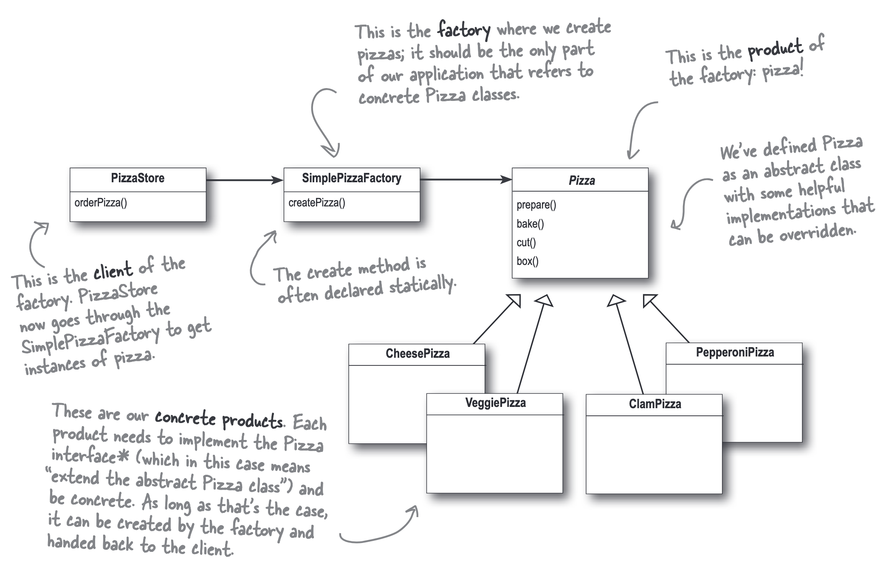
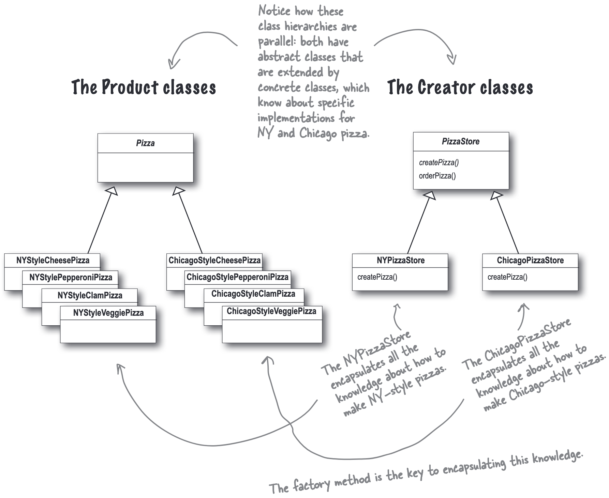
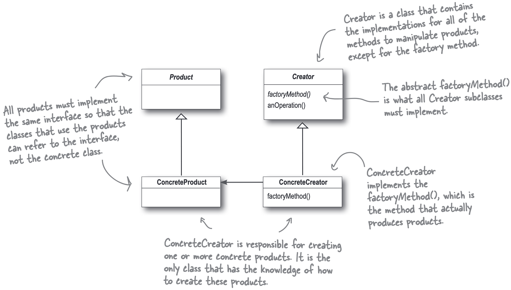

## Example1

When we meet code like this: We’ve got several concrete classes being instantiated, and the decision of which to instantiate is made **at runtime** depending on some set of conditions.

```java
Pizza orderPizza(String type) {
  Pizza pizza;
  if (type.equals("cheese")) {
    pizza = new CheesePizza();
  } else if (type.equals("greek")) {
    pizza = new GreekPizza();
  } else if (type.equals("pepperoni")) {
    pizza = new PepperoniPizza();
  } else {
    pizza = null; // or handle unknown type
  }
  if (pizza != null) {
    ...
  }
  return pizza;
}
```

{}
问题不在于 new 操作符本身，而在于它会将代码与“具体”的类实现紧密地耦合在一起。

1. 真正的罪魁祸首是“变化” (CHANGE)：当你在代码中直接使用 new 来创建一个具体类的实例时（例如 new Dog()），你的代码就焊死在了 Dog 这个具体的实现上。
2. 违反“开闭原则”：理想的设计应该是“对扩展开放，对修改关闭”。但如果将来系统需要变化，比如要换成使用 Cat 类，你就必须找到所有 new Dog() 的地方，然后修改代码。这就意味着你的代码对于“修改”并不是关闭的。为了扩展功能（增加一个新的类），你被迫要修改旧有的代码。
3. 缺乏灵活性：这种硬编码（hard-coding）的方式使得系统难以适应变化。而文中的解决方案是提倡“面向接口编程”，通过多态来隔离变化，从而让系统在不修改现有代码的情况下，就能适应新的具体类。
{}

We can use the **Simple Factory Pattern** to encapsulate the instantiation logic in a separate class.

```java
public class SimplePizzaFactory {
  public Pizza createPizza(String type) {
    Pizza pizza = null;

    if (type.equals("cheese")) {
      pizza = new CheesePizza();
    } else if (type.equals("pepperoni")) {
      pizza = new PepperoniPizza();
    } else if (type.equals("clam")) {
      pizza = new ClamPizza();
    } else if (type.equals("veggie")) {
      pizza = new VeggiePizza();
    }

    return pizza;
  }
}
```

{}
SimplePizzaFactory may have many clients. All of them can use the same factory to create pizzas, and they don’t need to know about the concrete classes. If we want to add a new type of pizza, we just need to modify the factory class without changing the client code.
{}

{}
Depends on the context.

If the factory is a utility class that provides a simple way to create objects without maintaining any state, then a static method is appropriate.
However, it can’t be subclassed or have the behavior of the `create(...)` method changed through inheritance.

If the factory needs to maintain state or configuration, then it should be an instance method.
{}

Using the Simple factory in a pizza store:

```java { hl_lines="2 4-6 10" }
public class PizzaStore {
  SimplePizzaFactory factory;

  public PizzaStore(SimplePizzaFactory factory) {
    this.factory = factory;
  }

  public Pizza orderPizza(String type) {
    Pizza pizza;
    pizza = factory.createPizza(type);

    pizza.prepare();
    pizza.bake();
    pizza.cut();
    pizza.box();

    return pizza;
  }
}
```

## The Simple Factory defined



* `PizzaStore` 持有 `SimplePizzaFactory` 的引用
* `SimplePizzaFactory` 负责创建 `Pizza` 对象
* `Pizza`是一个抽象类或接口或是一个类（我们说“implement an interface”并不是说一定要定义一个抽象的类或是一个Interface，一个具体的类作为具体的类的父类也是OK的），`CheesePizza`、`PepperoniPizza`、`ClamPizza` 和 `VeggiePizza` 都是 `Pizza` 的子类，是具体的实现类
* `PizzaStore` 通过 `SimplePizzaFactory` 的 `createPizza` 方法来创建具体的 `Pizza` 对象

## Example2

当我们需要有不同种类的`PizzaStore`时，我们可以对 [Example1](#example1) 做一些更改：把 `SimplePizzaFactory` 中的`createPizza` 方法放进 `PizzaStore` 中，并且把`PizzaStore`设置为抽象类，`createPizza`方法变成抽象方法。

```java {hl_lines="14"}
public abstract class PizzaStore {
  public Pizza orderPizza(String type) {
    Pizza pizza;
    pizza = createPizza(type);

    pizza.prepare();
    pizza.bake();
    pizza.cut();
    pizza.box();

    return pizza;
  }

  protected abstract Pizza createPizza(String type);
}
```

PizzaStore 是一个抽象类，它定义了一个抽象的 createPizza 方法。披萨的创建逻辑被延迟到 PizzaStore 的具体子类中去实现

这样，我们就可以创建不同的 `PizzaStore` 子类来实现不同的 `createPizza` 方法，例如：

```java
public class NYPizzaStore extends PizzaStore {
  @Override
  protected Pizza createPizza(String type) {
    if (type.equals("cheese")) {
      return new NYStyleCheesePizza();
    } else if (type.equals("pepperoni")) {
      return new NYStylePepperoniPizza();
    } else if (type.equals("clam")) {
      return new NYStyleClamPizza();
    } else if (type.equals("veggie")) {
      return new NYStyleVeggiePizza();
    } else {
      return null; // or handle unknown type
    }
  }
}

public class ChicagoPizzaStore extends PizzaStore {
  @Override
  protected Pizza createPizza(String type) {
    if (type.equals("cheese")) {
      return new ChicagoStyleCheesePizza();
    } else if (type.equals("pepperoni")) {
      return new ChicagoStylePepperoniPizza();
    } else if (type.equals("clam")) {
      return new ChicagoStyleClamPizza();
    } else if (type.equals("veggie")) {
      return new ChicagoStyleVeggiePizza();
    } else {
      return null; // or handle unknown type
    }
  }
}
```



Factory Method Pattern 的好处是：
实现了**产品的实现和使用**的解耦：`PizzaStore` 不需要知道具体的 `Pizza` 实现类，只需要知道如何使用 `createPizza` 方法来创建 `Pizza` 对象。

## Factory Method Pattern defined



The Factory Method Pattern defines an interface for creating an object, but lets subclasses decide which class to instantiate. Factory Method lets a class defer instantiation to subclasses.
工厂方法模式定义了一个用于创建对象的接口，但允许子类决定实例化哪一个类。工厂方法使一个类将实例化推迟到子类。

### The Simple Factory vs. Factory Method

对于 The Simple Factory 的主要目的是避免 `if-else` 模块反复在代码中出现，将构造的代码提出到一个单独的类中；而 Factory Method 的主要目的是主抽象类不实现具体的创建逻辑，而是将创建逻辑交给子类去实现。

{}

```java
// 主要目的是避免反复在代码中出现 if-else 判断模块
// SimplePaymentFactory：这是简单工厂模式的核心，负责所有 Payment 对象的创建
public class SimplePaymentFactory {
    // 静态方法通常是简单工厂的典型实现，因为不需要实例化工厂对象
    public static Payment createPayment(String type) {
        if ("paypal".equalsIgnoreCase(type)) {
            return new PayPalPayment();
        } else if ("credit".equalsIgnoreCase(type)) {
            return new CreditCardPayment();
        } else if ("personal_paypal".equalsIgnoreCase(type)) { // 新增的判断分支
            return new PersonalPayPalPayment();
        } else if ("business_paypal".equalsIgnoreCase(type)) { // 新增的判断分支
            return new BusinessPayPalPayment();
        }
        // 如果传入了未知的类型，可以抛出异常或返回 null
        throw new IllegalArgumentException("Unknown payment type: " + type);
    }
}

// 调用方式
Payment payment = SimplePaymentFactory.createPayment("paypal");
payment.process();
```

{}

{}

```java
// 抽象类定义框架，子类决定具体如何创建对象
public abstract class PaymentStore {
    public Payment orderPayment(String type) {
        Payment payment = createPayment(type);
        payment.process();
        return payment;
    }
    protected abstract Payment createPayment(String type);
}

// 具体子类实现创建逻辑
// 假设有不同类型的 PayPal 支付
public class PayPalPaymentStore extends PaymentStore {
    @Override
    protected Payment createPayment(String type) {
        // 子类根据传入的 type，在 PayPal 支付的家族中选择具体类型
        if ("personal".equals(type)) {
            return new PersonalPayPalPayment();
        } else if ("business".equals(type)) {
            return new BusinessPayPalPayment();
        }
        // 如果 type 不是预期的，可以抛出异常或返回 null
        throw new IllegalArgumentException("Unknown PayPal payment type: " + type);
    }
}

// 具体子类实现创建逻辑，用于信用卡支付
public class CreditCardPaymentStore extends PaymentStore {
    @Override
    protected Payment createPayment(String type) {
        // 子类根据传入的 type，在信用卡支付的家族中选择具体类型
        if ("visa".equals(type)) {
            return new VisaCreditCardPayment();
        } else if ("mastercard".equals(type)) {
            return new MasterCardCreditCardPayment();
        }
        // 如果 type 不是预期的，可以返回 null 或抛出异常
        throw new IllegalArgumentException("Unknown Credit Card type: " + type);
    }
}

// 调用方式
PaymentStore store = new PayPalPaymentStore();
Payment personalPay = store.orderPayment("personal"); 
Payment businessPay = store.orderPayment("business"); 

PaymentStore creditCardStore = new CreditCardPaymentStore();
Payment visaPay = creditCardStore.orderPayment("visa"); 
Payment masterCardPay = creditCardStore.orderPayment("mastercard");
```

{}